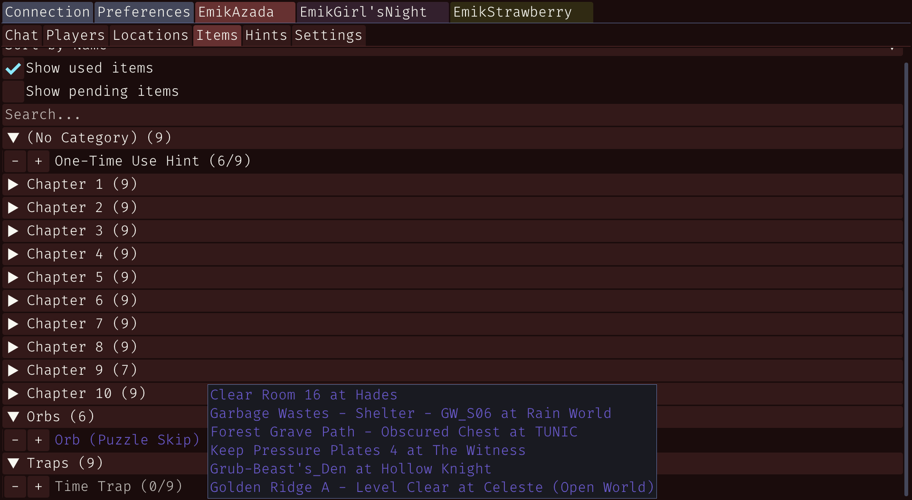
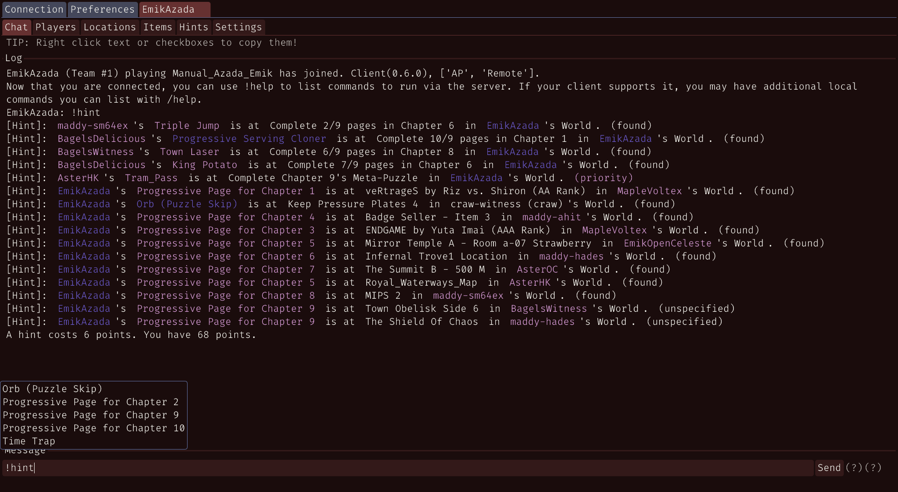

# Remote

Fully-functional standalone Windows/Mac/Linux/[Android*](#android) client for [Archipelago](https://archipelago.gg/), specializing in [Manual for Archipelago](https://github.com/ManualForArchipelago). **Ensure that [.NET 10](https://dotnet.microsoft.com/en-us/download/dotnet/10.0) is installed** prior to opening the application.

This project has a dependency to [Emik.Morsels](https://github.com/Emik03/Emik.Morsels), if you are building this project, refer to its [README](https://github.com/Emik03/Emik.Morsels/blob/main/README.md) first.

### [Latest Release (click me!)](https://github.com/Emik03/Remote/releases/latest)

---

- [Features](#features)
- [Screenshots](#screenshots)
- [Android](#android)
- [Thanks](#thanks)
- [Contribute](#contribute)
- [License](#license)

---

## Features

Many features address usability concerns over the original manual client:
- **Accident-proof**; You must tick a checkbox, press the "Release" button, and confirm the release again by holding down a separate button.
- **Out-of-logic is highlighted**; Locations not in logic are invisible by default, colored red, and a warning message appears when trying to break logic.
- **Drag-and-drop**; YAML files can be dropped into the window to immediately start a session.
- **Highlights BK**; Shows "BK" and "Done" to efficiently communicate the status of a manual slot.

It also includes other quality-of-life features to minimize setup time:
- Manage multiple sessions at the same time in one window, no need to open the application multiple times for each slot.
- Ability to communicate in the chat, see locations, and items, filtering with a search.
- Remembers the last server you logged in, automatically filling in the details upon startup.
- Highly customizable UI scaling and theming to ensure ease-of-use.
- Window can be resized to any resolution.
- Specify `REMOTE_PREFERENCES_PATH` to change the path of the `preferences.cfg` file.
- Specify `REMOTE_FONT_SIZE` to change the font size.

## Screenshots

## Android

Android builds are handled in a separate project file `Remote.Android`.

Currently, android builds do successfully compile and theoretically work on devices with a `x86_64` architecture, but for any other architecture are unable to launch properly due to the missing `cimgui` library.

As such, I do not publish Android builds at this current time.

If you wish to help out, you can discuss or provide resources in [this issue](https://github.com/Emik03/Remote/issues/1). This would be greatly appreciated.

When compiling the project yourself, make sure to specify `-c Debug` as compiling under release can take upwards of 20+ minutes.

## Thanks

Thank you to the following projects that make this possible:
- Application icon by [Ghostlyfield](https://bsky.app/profile/ghostlyfield.bsky.social)
- [Archipelago](https://archipelago.gg/)
- [Archipelago.MultiClient.Net](https://github.com/ArchipelagoMW/Archipelago.MultiClient.Net)
- [Archipelago.MultiClient.Net.Analyzers](https://github.com/BadMagic100/Archipelago.MultiClient.Net.Analyzers)
- [cimgui](https://github.com/cimgui/cimgui)
- [Fira Code](https://github.com/tonsky/FiraCode/) (go [sponsor Nikita Prokopov](https://github.com/sponsors/tonsky)!)
- [imgui](https://github.com/ocornut/imgui) (go [sponsor them](https://github.com/ocornut/imgui/wiki/Funding)!)
- [ImGui.NET](https://github.com/ImGuiNET/ImGui.NET)
- [ManualForArchipelago](https://github.com/ManualForArchipelago/Manual)
- [MonoGame](https://monogame.net) (go [sponsor them](https://github.com/sponsors/MonoGame)!)
- [Noto Sans](https://fonts.google.com/noto)
- [PupNet Deploy](https://github.com/kuiperzone/PupNet-Deploy)
- [YamlDotNet](https://github.com/aaubry/YamlDotNet/wiki) (go [sponsor Edward Cooke](https://github.com/sponsors/EdwardCooke)!)

## Contribute

Issues and pull requests are welcome to help this repository be the best it can be.

## License

This repository largely falls under the [MPL-2 license](https://www.mozilla.org/en-US/MPL/2.0/).

The `Fonts` directory is subject to a separate license, being a redistribution of [Fira Code]().
